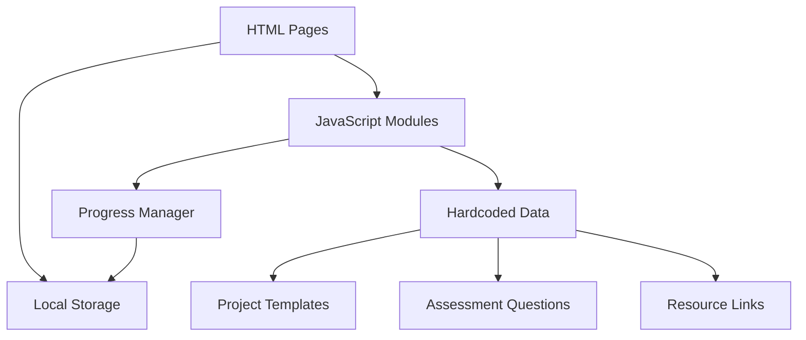

# Design Document

## Overview

The Tutorial Escape Platform is a web-based application that guides developers from passive tutorial consumption to active project building. This MVP prototype focuses on core essentials to demonstrate feasibility and address "tutorial hell." The system consists of four main components: a basic skill assessment engine (3-5 question quiz), simple project generator (single focused projects with 3-5 milestones), basic progress tracker (visual checklist), and minimal resource provider (one targeted link per milestone). The architecture prioritizes simplicity, clean interface design, and distraction-free user experience over complex features.

## Architecture

The platform follows a simple client-only architecture using vanilla HTML, CSS, and JavaScript with hardcoded data. The system is designed to be stateless with local storage for progress persistence, eliminating the need for frameworks, backend servers, or databases.



### Technology Stack
- **Frontend**: Vanilla HTML5, CSS3, and JavaScript (ES6+)
- **Styling**: Custom CSS with CSS Grid and Flexbox for layout
- **Data Layer**: Hardcoded JavaScript objects and arrays
- **Storage**: Browser Local Storage for progress persistence
- **State Management**: Simple JavaScript object state management
- **Deployment**: Static file hosting (GitHub Pages, Netlify, or any web server)

## Components and Interfaces

### 1. Assessment Engine

**Purpose**: Provides basic skill evaluation through a simple onboarding quiz to generate personalized project recommendations

**Design Rationale**: Keeping the assessment to 3-5 questions ensures quick onboarding without overwhelming new users, while still capturing essential skill level information.

**Key Components**:
- Assessment HTML page: Simple 3-5 question quiz form presented to new users
- `assessmentManager.js`: JavaScript module that processes responses and generates basic tailored project recommendations
- Skill level constants: Beginner, Intermediate, Advanced classifications (with focus on beginner-level projects like to-do apps)

**JavaScript Functions**:
```javascript
// Hardcoded service functions in assessmentManager.js
getAssessmentQuestions() - Return hardcoded assessment questions array
processAssessmentResults(responses) - Process responses with hardcoded logic
getProjectRecommendation(skillLevel) - Return hardcoded project recommendation
```

### 2. Project Generator

**Purpose**: Provides one focused project idea broken into small, actionable milestones without overwhelming complexity

**Design Rationale**: Limiting to single focused projects (no stretch goals) and 3-5 tiny milestones prevents decision paralysis and keeps users focused on building rather than choosing between options.

**Key Components**:
- Project HTML page: Displays simple project structure with essential milestones only
- `projectManager.js`: JavaScript module that matches user skills to one appropriate project recommendation
- Milestone HTML sections: Display 3-5 actionable project steps with guiding hints

**Project Data Structure**:
```javascript
// Hardcoded project template objects in projectData.js
const projectTemplate = {
  id: "string",
  name: "string",
  description: "string",
  skillLevel: "beginner|intermediate|advanced",
  techStack: ["array", "of", "technologies"],
  estimatedHours: "number",
  milestones: [
    // Limited to 3-5 milestones
    // Note: No stretch goals to maintain focus
  ]
};

const milestone = {
  id: "string",
  title: "string",
  description: "string",
  hint: "string", // Single short guiding hint per milestone
  estimatedTime: "number",
  helpResource: "object" // One targeted resource per milestone
};
```

### 3. Progress Tracker

**Purpose**: Provides simple visual progress tracking to maintain motivation and accountability

**Design Rationale**: Using a basic checklist format ensures clarity and immediate visual feedback without complex progress visualizations that could distract from the core building activity.

**Key Components**:
- Progress HTML section: Simple visual progress tracker showing all milestones in checklist format
- Milestone checkbox elements: Individual milestone completion interface with "mark as done" functionality
- `progressManager.js`: JavaScript module that manages basic progress state and persistence

**Progress Data Structure**:
```javascript
// Stored in localStorage and managed by progressManager.js
const userProgress = {
  projectId: "string",
  completedMilestones: ["array", "of", "milestone", "ids"],
  currentMilestone: "string",
  startDate: "ISO date string",
  lastActivity: "ISO date string",
  totalProgress: "number" // 0-100 percentage for visual indicator
};
```

### 4. Resource Provider

**Purpose**: Provides minimal, targeted help resources to prevent falling back into tutorial consumption patterns

**Design Rationale**: Limiting to one relevant, concise resource per milestone prevents information overload and maintains focus on building. Prioritizing official documentation over tutorials reinforces the goal of escaping tutorial dependency.

**Key Components**:
- Help link elements: Simple help resource HTML links
- `resourceData.js`: JavaScript file containing curated, milestone-specific resources
- Help section HTML: Displays single contextual help resource per milestone

**Resource Data Structure**:
```javascript
// Hardcoded resource objects in resourceData.js
const resourceLink = {
  title: "string",
  url: "string",
  type: "documentation|reference", // Focused on docs, not tutorials
  description: "string"
  // Note: Removed estimatedReadTime to keep structure simple
};
```

## Data Models

### Local Storage Data
```javascript
// Stored in browser localStorage as JSON strings
const userSession = {
  skillLevel: "beginner|intermediate|advanced",
  currentProject: "string",
  assessmentCompleted: "boolean",
  createdAt: "ISO date string"
};

const projectProgress = {
  projectId: "string",
  completedMilestones: ["array", "of", "milestone", "ids"],
  currentMilestone: "string",
  startDate: "ISO date string",
  lastActivity: "ISO date string"
};
```

### Hardcoded Data Structures
```javascript
// Defined in separate .js files as constants
const assessmentQuestion = {
  id: "string",
  question: "string",
  options: ["array", "of", "answer", "options"],
  skillWeights: {
    beginner: "number",
    intermediate: "number", 
    advanced: "number"
  }
};

const assessmentResult = {
  skillLevel: "string",
  recommendedProject: "string",
  explanation: "string"
};
```

## Error Handling

### Client-Side Error Handling
- **Network Errors**: Graceful degradation with offline-capable progress saving
- **Validation Errors**: Real-time form validation with clear error messages
- **State Errors**: Automatic recovery mechanisms for corrupted local state

### Local Storage Error Handling
- **Storage Availability**: Graceful degradation when local storage is unavailable
- **Data Corruption**: Recovery mechanisms for corrupted local storage data
- **Storage Limits**: Handling of storage quota exceeded scenarios

### Error Handling Format
```typescript
interface AppError {
  type: 'storage' | 'validation' | 'data';
  message: string;
  recoverable: boolean;
  timestamp: Date;
}
```

## Testing Strategy

### Unit Testing
- **JavaScript Functions**: Simple test functions or basic testing framework for utility functions
- **DOM Manipulation**: Manual testing of HTML element interactions
- **Coverage Target**: Focus on testing core logic functions (assessment processing, progress tracking)

### Integration Testing
- **Local Storage Testing**: Test localStorage read/write operations manually
- **Function Testing**: Test hardcoded data functions and logic manually
- **End-to-End Testing**: Manual testing of complete user journeys through HTML pages

### Test Scenarios Priority
1. **Assessment Flow**: Complete skill assessment and project recommendation with hardcoded data
2. **Progress Tracking**: Milestone completion and local storage persistence
3. **Project Generation**: Appropriate project matching based on skill level
4. **Resource Access**: Help resource availability from hardcoded data

### Performance Testing
- **Page Load Speed**: Optimize HTML, CSS, and JavaScript file sizes for fast loading
- **Local Storage**: Test read/write performance for progress data
- **DOM Manipulation**: Ensure smooth interactions and updates

## User Interface Design Principles

### Clean, Distraction-Free Interface
**Design Rationale**: The interface prioritizes simplicity and clarity to keep users focused on building rather than navigating complex features.

**Key Principles**:
- **Focused Content**: Show only essential details for the current milestone
- **Clear Navigation**: Provide clear paths between assessment, project view, and progress tracking
- **Visual Hierarchy**: Use clean design with focused content and minimal visual clutter
- **Progressive Disclosure**: Display information progressively to avoid overwhelming users

### Responsive and Accessible Design
- **CSS Media Queries**: Ensure functionality across desktop and mobile devices using responsive CSS
- **Semantic HTML**: Use proper HTML5 semantic elements for accessibility
- **Accessibility**: Implement ARIA labels, keyboard navigation, and screen reader support
- **Performance**: Optimize CSS and JavaScript for fast loading and smooth interactions

## Security Considerations

### Data Privacy
- **Local-Only Data**: All user data stored locally in browser, no server transmission
- **Anonymous Usage**: No user registration or identification required
- **Data Control**: Users can clear their data by clearing browser storage

### Input Validation
- **Assessment Responses**: Client-side validation of user inputs against expected formats
- **Progress Updates**: Validate milestone completion data before local storage
- **Resource Links**: Hardcoded resource URLs ensure safety and reliability

### Security Considerations
- **XSS Protection**: Sanitize any user inputs before rendering
- **Local Storage Security**: Validate data integrity when reading from local storage
- **External Links**: All resource links are curated and hardcoded for safety